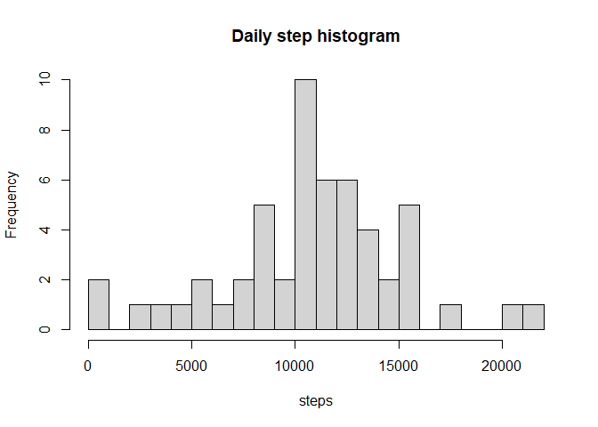
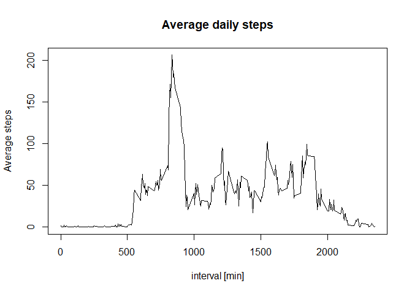
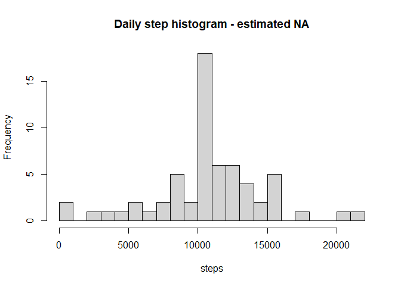
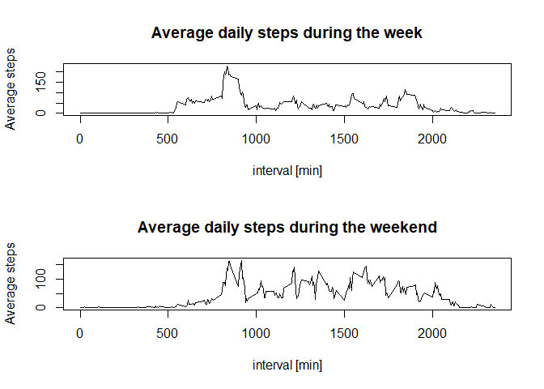

## Introduction
It is now possible to collect a large amount of data about personal movement using activity monitoring devices such as a Fitbit, Nike Fuelband, or Jawbone Up. These type of devices are part of the “quantified self” movement – a group of enthusiasts who take measurements about themselves regularly to improve their health, to find patterns in their behavior, or because they are tech geeks. But these data remain under-utilized both because the raw data are hard to obtain and there is a lack of statistical methods and software for processing and interpreting the data.

This assignment makes use of data from a personal activity monitoring device. This device collects data at 5 minute intervals through out the day. The data consists of two months of data from an anonymous individual collected during the months of October and November, 2012 and include the number of steps taken in 5 minute intervals each day.

The data for this assignment can be downloaded from the course web site: [Data archive](https://d396qusza40orc.cloudfront.net/repdata%2Fdata%2Factivity.zip)

The variables included in this dataset are:

- *steps*: Number of steps taking in a 5-minute interval (missing values are coded as \color{red}{\verb|NA|}NA)
- *date*: The date on which the measurement was taken in YYYY-MM-DD format
- *interval*: Identifier for the 5-minute interval in which measurement was taken

The dataset is stored in a comma-separated-value (CSV) file and there are a total of 17,568 observations in this dataset.

## Loading and preprocessing the data
First, let's load some packages that will be used throughout the solution.

```r
library(dplyr)
```

```
## 
## Attaching package: 'dplyr'
```

```
## The following objects are masked from 'package:stats':
## 
##     filter, lag
```

```
## The following objects are masked from 'package:base':
## 
##     intersect, setdiff, setequal, union
```

```r
library(tidyr)
library(lubridate)
```

```
## 
## Attaching package: 'lubridate'
```

```
## The following objects are masked from 'package:base':
## 
##     date, intersect, setdiff, union
```

Next, we'll unzip the data folder and store the data in a subfolder called *data*, before loading it in into memory.

```r
unzip('activity.zip', exdir='data')
data <- read.csv('data/activity.csv')
```

## What is mean total number of steps taken per day?
First, let us calculate the total number of steps taken per day. For this, we can group the dataframe by the date variable, and use the *summarize()* function, and store the total under a new variable *total_steps*. Note that there are a lot of NA values in the step vector: we will ignore them for now.

```r
data_by_day <- group_by(data, date)
steps_daily <- summarize(data_by_day, 'total_steps'=sum(steps))
head(steps_daily, 10)
```

```
## # A tibble: 10 × 2
##    date       total_steps
##    <chr>            <int>
##  1 2012-10-01          NA
##  2 2012-10-02         126
##  3 2012-10-03       11352
##  4 2012-10-04       12116
##  5 2012-10-05       13294
##  6 2012-10-06       15420
##  7 2012-10-07       11015
##  8 2012-10-08          NA
##  9 2012-10-09       12811
## 10 2012-10-10        9900
```

Above, the first ten entries are printed out. However, a histogram gives a better overview of the walking behavior of the individual:

```r
hist(steps_daily$total_steps, breaks=22, xlab='steps', main='Daily step histogram')
```

<!-- -->

Finally, it is interesting to look a the mean and median values of the total daily step count:

```r
mean_daily <- mean(steps_daily$total_steps, na.rm=TRUE)
median_daily <- median(steps_daily$total_steps, na.rm=TRUE)
message('The average of total daily steps is ', mean_daily)
```

```
## The average of total daily steps is 10766.1886792453
```

```r
message('The median of total daily steps is ', median_daily)
```

```
## The median of total daily steps is 10765
```

## What is the average daily activity pattern?
To answer this question, we use the same strategy of grouping and summarizing, but this time for the interval variable.

```r
steps_per_interval <- group_by(data, interval)
average_over_day <- summarize(steps_per_interval, 'average_steps'=mean(steps, na.rm=TRUE))
head(average_over_day, 10)
```

```
## # A tibble: 10 × 2
##    interval average_steps
##       <int>         <dbl>
##  1        0        1.72  
##  2        5        0.340 
##  3       10        0.132 
##  4       15        0.151 
##  5       20        0.0755
##  6       25        2.09  
##  7       30        0.528 
##  8       35        0.868 
##  9       40        0     
## 10       45        1.47
```

And we can plot this time series:

```r
plot(average_over_day$interval, average_over_day$average_steps, type='l', xlab='interval [min]', ylab='Average steps', main='Average daily steps')
```

<!-- -->

Finally, it is interesting to look at which time during the day, on average, the most steps were taken. For this we will rearrange our *steps_per_interval* dataframe by sorting the number of steps in descending order. Then, the time interval in question is the first one listed in the dataframe.

```r
average_over_day_sorted <- arrange(average_over_day, desc(average_steps))
max_interval <- as.numeric(average_over_day_sorted[1,1])
message('On average max interval is: ', max_interval)
```

```
## On average max interval is: 835
```

## Imputing missing values
As said before, many entries for the *step* variable are not valid (i.e. NA). How many non valid observations are there exactly?

```r
total_na <- sum(!complete.cases(data))
message('There are ', total_na, ' non valid entries.')
```

```
## There are 2304 non valid entries.
```

Hence, we may need a way of estimating these missing values. It is chosen here that for the missing entries in a certain time interval, the average value of that given time interval is used as a replacement value. (i.e. the value from *average_over_day*).

In order to achieve this, first, we make the *date* variable of the main dataframe explicitly as a date class type. This is done such that the chronological sorting later on certainly correct.

```r
data$date <- ymd(data$date)
```

Next we will form a second dataset *data2* which is a copy from the original data, but with the NA values replaced. It is formed through a multi-step pipeline that:

1. Merges the *data* and the *average_over_day* dataframes by the *interval* variable
2. Arranges this merged, based on sorting of the dates. (Hence the previous step of explicitly introducing a date class type) 
3. Mutates the *steps* variable with an *ifelse* function that copies the *average_steps* variable if the NA case comes up


```r
data2 <- merge(data, average_over_day, by='interval') %>% 
          arrange(date) %>% 
          mutate(steps = ifelse(is.na(steps), average_steps, steps)) %>% select(steps,date,interval)
```

We can, in exactly the same way as before, create a histogram and calculate the mean and median of the total daily step count.

```r
data_by_day2 <- group_by(data2, date)
steps_daily2 <- summarize(data_by_day2, 'total_steps'=sum(steps))
hist(steps_daily2$total_steps, breaks=22, xlab='steps', main='Daily step histogram - estimated NA')
```

<!-- -->


```r
mean_daily2 <- mean(steps_daily2$total_steps)
median_daily2 <- median(steps_daily2$total_steps)
```

To compare both mean and median values, let's list them in a table

Dataset | mean daily steps | median daily steps
--------|------------------|-------------------
with NA |1.0766189\times 10^{4}    | 10765
with estimated values | 1.0766189\times 10^{4} | 1.0766189\times 10^{4}

We can see that the difference is not that big, which, on average, seems positive.


## Are there differences in activity patterns between weekdays and weekends?
To answer this question, we'll once again make a new copy of the dataset, and this time add variables for the weekday and whether or not this is a day of the weekend.

This is once again done in a pipeline, of which the steps comprise:

1. mutate the *data2* dataset (i.e. with estimations for missing values) with a variable that derives the weekday from the *date* variable. (The returned weekdays are in Dutch, as this is my native language.)
2. mutate this intermediate result with a new variable called *week_period* that classifies the weekday as week or weekend. This classification is done with a factor function, where a logical vector is levelled as 'week' or 'weekend'. Notice that if you want to rerun the code for yourself, you may want to change the vector with weekdays in the factor function to the days in your native language (or the language in which your computer is set).


```r
data_week_weekend <- data2 %>% mutate('Day'=weekdays(date)) %>% 
          mutate(week_period = factor(Day %in% c("maandag","dinsdag","woensdag","donderdag","vrijdag"), levels=c(FALSE, TRUE), labels=c('weekend','week')))
```

Now, we can, like before, summarize the results. As always, we start by grouping the dataset. However, now we have to group for two variables: *week_period* and *interval*, such that a mean value for all combinations of these two grouping variables can be calculated.

```r
steps_per_week_weekend <- group_by(data_week_weekend, week_period,interval)
average_over_day_week_weekend <- summarize(steps_per_week_weekend, average_steps = mean(steps))
```

```
## `summarise()` has grouped output by 'week_period'. You can override using the
## `.groups` argument.
```

To split this average dataframe into one frame for the week and one for the weekend, we can use the *filter()* function, where we filter on *week_period*.

```r
average_over_week <- filter(average_over_day_week_weekend, week_period=='week')
average_over_weekend <- filter(average_over_day_week_weekend, week_period=='weekend')
head(average_over_week, 5)
```

```
## # A tibble: 5 × 3
## # Groups:   week_period [1]
##   week_period interval average_steps
##   <fct>          <int>         <dbl>
## 1 week               0        2.25  
## 2 week               5        0.445 
## 3 week              10        0.173 
## 4 week              15        0.198 
## 5 week              20        0.0990
```

```r
head(average_over_weekend, 5)
```

```
## # A tibble: 5 × 3
## # Groups:   week_period [1]
##   week_period interval average_steps
##   <fct>          <int>         <dbl>
## 1 weekend            0       0.215  
## 2 weekend            5       0.0425 
## 3 weekend           10       0.0165 
## 4 weekend           15       0.0189 
## 5 weekend           20       0.00943
```

Finally we can plot time series and look if there is a noticeable change in the weekday behavior as compared to the weekend behavior.

```r
par(mfrow=c(2,1))
plot(average_over_week$interval, average_over_week$average_steps, type='l', 
     xlab='interval [min]', ylab='Average steps', main='Average daily steps during the week')
plot(average_over_weekend$interval, average_over_weekend$average_steps, type='l', 
     xlab='interval [min]', ylab='Average steps', main='Average daily steps during the weekend')
```

<!-- -->


